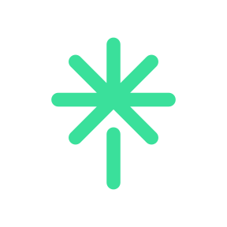

<h1 align="center">
  <samp>Hey there! I'm <a href="" style="pointer-events: none">Vaishnavi Vaishnav</a></samp>
</h1>

  <h3 align="center"><samp>Software Developer | An Open Source Contributor | Challenge-Driven</samp></h3>

 

- 🎓 <samp>**2024 graduate** from JECRC University with a B.Tech. in *Computer Science and Engineering*, specializing in AI & ML in collaboration with IBM.</samp>
- 👨‍💻 <samp>Building systems that don’t break under pressure. You’re welcome.</samp>
- ✨ <samp>Turning designs into pixel-perfect reality with code (and a little bit of magic)</samp>
- 🤔 <samp>Writing code, teaching kids, smashing shuttlecocks—sometimes all at once</samp>
- 🌱 <samp>Open source? Absolutely! I like to contribute while quietly questioning my life choices (just kidding, I love it). Always up for learning something new – even from a 10-year-old tech prodigy, because why not?</samp>
- 🧩 <samp>Looking for a **contractual** or a **full-time gig**? Awesome. I can do serious work too, promise. You might even be impressed with how much I don’t break things on a daily basis.</samp>
 

  <h2><b><samp>Skills | Languages | Tools</samp></b></h2>
  

    
    
    
    
    
    
    
    
    
    
    
    
    
    
    
    
    
    
    
    
    
    
    
    
    
    
    
    
    
    
    
    
    
    
    
    
    
    
    
    
    
    
    
    
    
    
    
  

  <h2><b><samp>Designing Tools</samp></b></h2>
  

    
    
    
    
    
    
    
    
    
  

  <h2><b><samp>GitHub Profile</samp></b></h2>
  
  

  <h2><b><samp>GitHub Activity</samp></b></h2>
  

    
    
    
  

  <h3>
    <b><samp>Let’s Connect! If you enjoy my work even a little, maybe think about treating me to a coffee or tea?  <a href="" style="pointer-events: none">After all, caffeine fuels creativity!</a> 🥺👉👈</samp></b>
  </h3>

  <a href="https://www.linkedin.com/in/vaishnavi-vaishnav">
    &nbsp;
  </a>
  <a href="https://linktr.ee/pixie27.ai">
    &nbsp;
  </a>
  <a href="mailto:vaishnavivaishnav0000@gmail.com">
    &nbsp;
  </a>
  <a href="https://www.instagram.com/nerd.coder/">
    &nbsp;
  </a>
  <a href="https://www.github.com/vaishnavi-vaishnav">
    &nbsp;
  </a>
  <a href="https://app.slack.com/client/T6M8YKEBA/D07BBGP2N3X" target="_blank">
    &nbsp;
  </a>
  <a href="https://www.behance.net/pixie27_ai" target="_blank">
    &nbsp;
  </a>
  

<!-- 

  <h3><b><samp> Spotify Playing 🎧</samp></b></h3>

 -->
 

<!--     -->
  
 
  

<!-- 
-->
